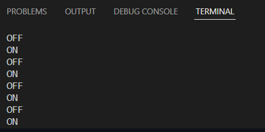
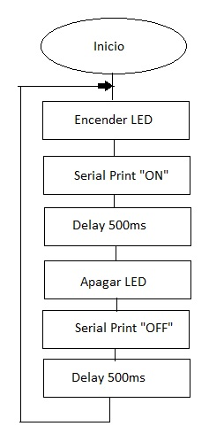

# Practica1: BLINK
En la següent pràctica veurem el funcionament dels microprocessadors,l'estructura del codi i l'utilització dels pins GPIO(General Purpose Input/Output).

# Codi
```cpp
#include <Arduino.h> //llibreries Necessàries
//Definició pin del LED
#define PIN 14
//set up
void setup() {
Serial.begin(115200);//Iniciar el Serial Monitor
pinMode(PIN, OUTPUT);//Configuració del PIN
}
//loop
void loop() {

digitalWrite(PIN, HIGH);//Escriptura digital Per fer funcionar el led(HIGH)
Serial.println("ON");// Visualització de la paraula "ON" al Serial MOnitor
delay(500);//Pausa del Processador 500ms
digitalWrite(PIN, LOW);//Escriptura digital Per fer funcionar el led(LOW)
Serial.println("OFF");// Visualització de la paraula "FF" al Serial Monitor
delay(500);//Pausa del Processador 500ms
}
```
# Explicació
En aquest codi creat per la ESP32 basat en el llenguatge Arduino farem que un led situat al pin 14 parpellegi en un interval de 500ms a més per al Serial Monitor enviarà un missatge quan el LED estigui en ON o en OFF.

**Llibreries i variables:**

En aquesta part del programa inclourem les llibreries necessàries per poder compilar el programa en aquest cas utilitzarem la llibreria Arduino.h que és necessària per poder operar amb el llenguatge Arduino, treballar amb els pins i fer funcions bàsiques ja integrades.

També abans d'entrar en el Setup declarem unes variables fixes per poder treballar més còmodament en aquest cas delcararem la variable PIN i l'assignem el pin numero 14
```cpp
#include <Arduino.h>
//pin del LED
#define PIN 14
```

**Setup:**
En aquesta part del programa configurarem tots els pins i inicialitzem totes les funcions que farem servir com el Serial.
```cpp
void setup() {
Serial.begin(115200);
pinMode(PIN, OUTPUT);
}
```
**Main Loop:**
En aquesta part del programa es on escriurem les ordres principals que executarà el processador en aquest cas encendre i apagar el LED amb un delay de 500ms a més d'enviar un missatge al Serial dient si està en ON o OFF.
```cpp
void loop() {

digitalWrite(PIN, HIGH);//Escriptura digital Per fer funcionar el led(HIGH)
Serial.println("ON");// Visualització de la paraula "ON" al Serial Monitor
delay(500);//Pausa del Processador 500ms
digitalWrite(PIN, LOW);//Escriptura digital Per fer funcionar el led(LOW)
Serial.println("OFF");// Visualització de la paraula "OFF" al Serial Monitor
delay(500);//Pausa del Processador 500ms
}
```



**Diagrama de Flux**



**Comentaris**

El processador tindra un temps lliure de 500ms que es el temps que triga en cambiar d'estat.Pero es un temps que no es pot aprofitar ja que la funcio Delay() bloqueja el processador i el deixa inservible.
